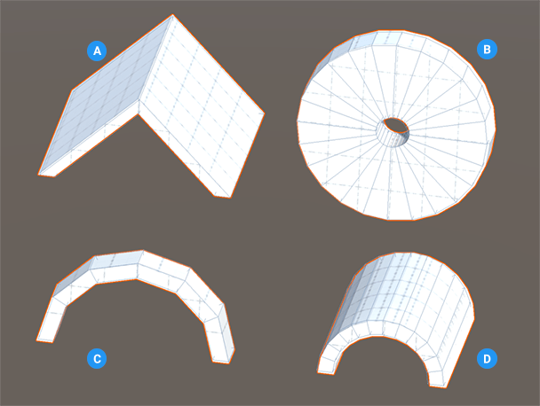

# Arch
The basic arch shape is  a curved symmetrical shape (see **A** in the image below). You can customize the basic arch shape to create tunnels, pipes, roofs, and many other objects.

**(A)** Roof: Arch with 2 sides and increased depth

**(B)** Wheel: Arch with increased number of sides, thickness and degrees (and no end cap)

**(C)** Basic arch shape (default values)

**(D)** Tunnel: Arch with increased depth and thickness

When you customize an arch shape, keep in mind that when you change the thickness and number of sides, it is relative to the overall size and circumference. For example, two arches with the same thickness but where one arch is twice as long as the other look very different. The shorter one appears much smoother than the other.

You can customize the shape of an arch with these shape-specific properties:

| **Property:** | **Description:** |
|:-- |:-- |
| __Thickness__ | Set the thickness of the arch in meters. The larger the thickness, the smaller the opening becomes. The default value is 0.1. The minimum value is 0.01. |
| __Sides Count__ | Set the number of sides for the arch. The more sides you use (relative to the size of the __Radius__), the smoother the arch becomes, so the closer you get to a semi-circle. Conversely, if you this value to 2, the arch turns into a peaked roof, regardless of the radius. The default value is 5. Valid values range from 3 to 200. |
| __Arch Circumference__ | Set the circumference of the arch in degrees. For example, an arch of 360 degrees is circular. The default value is 180. Valid values range from 1 to 360. |
| __End Caps__ | Enable this option to create faces for the ends of the arch (default).   Disable this option if you know the ends are not visible to the camera (this is an [optimization strategy](workflow-edit-tips.md) that reduces the number of polygons that Unity has to render). |
| **Smooth** | Enable this option to smooth the edges of the polygons. This property is enabled by default. |
