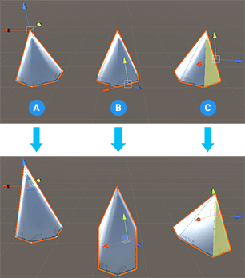

#  Offset Elements

The __Offset Elements__ action moves the selected element(s) according to the default values. You can change the default values with the **Offset Settings**. 

This tool is available in Vertex, Edge, and Face edit mode and appears as **Offset Vertices**, **Offset Edges**, and **Offset Faces** on the text buttons on the ProBuilder toolbar.

From the main menu, select **Tools** > **ProBuilder** > **Geometry** > **Offset Elements**.

## Offset Elements options

Using the Offset Settings lets you enter a precise value to move vertices, edges, and faces.

<table>
<thead>
<tr>
<th colspan="2"><strong>Property:</strong></th>
<th><strong>Description:</strong></th>
</tr>
</thead>
<tbody>
<tr>
<td colspan="2"><strong>Coordinate Space</strong></td>
<td>Select the relative space for moving the elements. </td>
</tr>
<tr>
<td></td>
<td><strong>World</strong></td>
<td>Move the element in world space. This is the default.</td>
</tr>
<tr>
<td></td>
<td><strong>Local</strong></td>
<td>Move the element relative to the GameObject.</td>
</tr>
<tr>
<td></td>
<td><strong>Element</strong></td>
<td>Move the element relative to the itself.</td>
</tr>
<tr>
<td></td>
<td><strong>Handle</strong></td>
<td>Moves the element relative to the handle.</td>
</tr>
<tr>
<td colspan="2"><strong>Translate</strong></td>
<td>Set positive or negative values to move for each axis. By default, <strong>X</strong> and <strong>Z</strong> are set to 0 and <strong>Y</strong> is set to 1.</td>
</tr>
</tbody>
</table>

